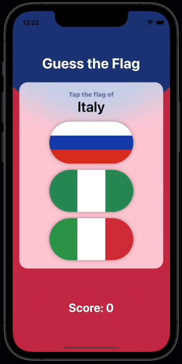

# Day 22 – Project 2: Guess the Flag part 1

_[https://www.hackingwithswift.com/100/swiftui/22](https://www.hackingwithswift.com/100/swiftui/22)_

Project directory can be found [here](../../projects/GuessTheFlag/)

## Challenge

1. Add an @State property to store the user’s score, modify it when they get an answer right or wrong, then display it in the alert and in the score label.
2. When someone chooses the wrong flag, tell them their mistake in your alert message – something like “Wrong! That’s the flag of France,” for example.
3. Make the game show only 8 questions, at which point they see a final alert judging their score and can restart the game.

