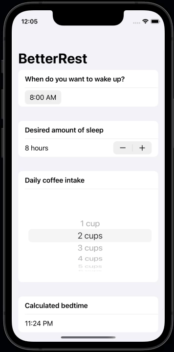

# Day 28 – Project 4: BetterRest part 3

_[https://www.hackingwithswift.com/100/swiftui/28](https://www.hackingwithswift.com/100/swiftui/28)_

## Challenge

1. Replace each `VStack` in our form with a `Section`, where the text view is the title of the section. Do you prefer this layout or the VStack layout? It’s your app – you choose!
2. Replace the “Number of cups” stepper with a `Picker` showing the same range of values.
3. Change the user interface so that it always shows their recommended bedtime using a nice and large font. You should be able to remove the “Calculate” button entirely.

## Output

## Source/Solution

[BetterRest](../../projects/BetterRest/)
